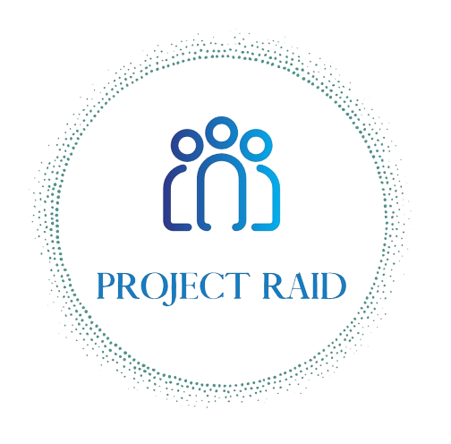

# Project Raid

## What Is Project Raid?

Project Raid is a powerful tool designed to streamline group coordination. Whether you’re organizing a gaming guild,   planning team meetings, or scheduling collaborative work sessions, this platform has you covered.

### Planned Key Features:

- Availability Tracking:
  Input your available times effortlessly.
  The program automatically calculates overlapping timeframes.
  Say goodbye to endless scheduling emails!
- Optimal Time Coordination:
  Discover the best time slots when everyone is available.
  No more missed opportunities due to conflicting schedules.
- Future Enhancements:
  We’re committed to continuous improvement.
  Upcoming features include a user-friendly GUI for tracking raids and setting up recurring schedules.

### Why Choose Project Raid?

- Efficiency: Save time and reduce frustration by coordinating effortlessly.
- Collaboration: Bring your team together seamlessly.
- Flexibility: Adapt to changing schedules with ease.

## Changelog

### 06.05.2024

- Name set  
- Logo Created  
- Layout changed  
- Dead Code deleted  
- Updated README

devpush
